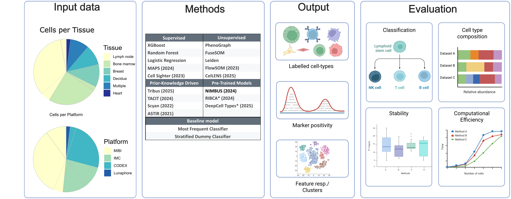
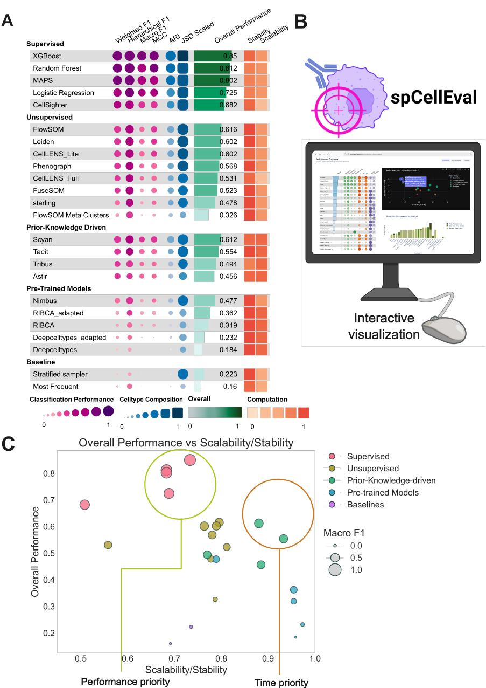

# spCellEval - Benchmarking Cell Phenotyping Methods in Spatial Proteomics 

We present "spCellEval", a quantitative comparison of automated/semi-automated cell phenotyping methods for Spatial Proteomics datasets on a diverse set of 10 curated public datasets. The methods are compared with a list of label transfer metrics divided into 4 categories: classification performance, distribution recovery, stability and scalability. This benchmark acts as a foundation to evaluate and improve automated cell phenotyping. 



## Current Results Overview: 


## Getting Started

Scripts to run each method are provided within `src/<method>`.

Datasets and parameter settings will be uploaded to a public repository soon!

### Evaluation Scripts
The notebooks in  `src/metrics_scripts` can be used to get the complete metrics on all methods for each dataset. 

### Adding your own method
To officially add your own method, please open an issue and provide us with the following to reproduce your method. 
1. GitHub repo for the method
2. List of Parameters used (if any)
3. Your predictions (optional: would make things faster for us)

Folder Structure to add your predictions in 
```
results/
├── Method1/
│   └── predictions_*.csv
├── Method2/
└── Method3/
```


