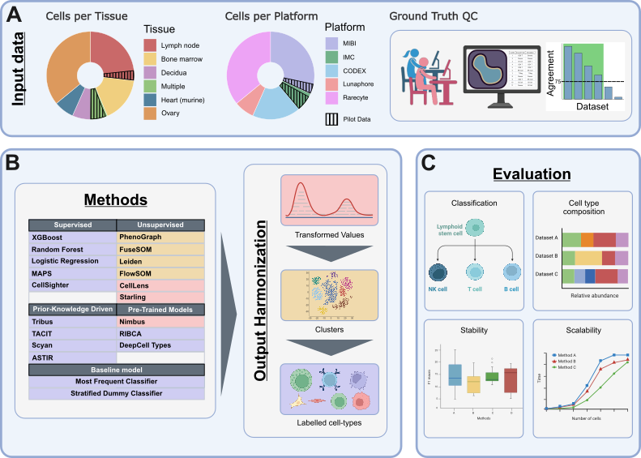
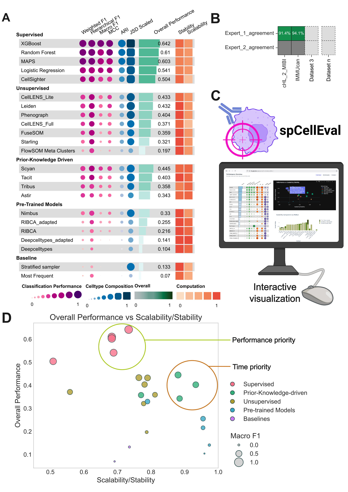

#  logotype" src="./website/plotly_figures/logo_example.png" style="height: 2em; vertical-align: middle;"> spCellEval - Benchmarking Cell Phenotyping Methods in Spatial Proteomics 

We present ["spCellEval"](https://huggingface.co/spaces/Arozhada/spcelleval), a quantitative comparison of automated/semi-automated cell phenotyping methods for Spatial Proteomics datasets on a diverse set of 13 curated public datasets. The methods are compared with a list of label transfer metrics divided into 4 categories: classification performance, distribution recovery, stability and scalability. This benchmark acts as a foundation to evaluate and improve automated cell phenotyping. 



## Current Results Overview: 


## Getting Started

In order to reproduce the results, the raw datasets currently need to be downloaded from public repositories. Please refer to the public registered Stage 1 manuscript. [IMMUCan](https://zenodo.org/records/12912567) is one example dataset. The downloaded datsets should be added as the following folder structure. 

```
spCellEval/
├── src/                          # Core benchmarking logic
│   ├── QC                        # Main script to QC datasets
│   ├── evaluation                # Main script to aggregate/collect results
│   ├── plotting                  # Main script to get plots
│   ├── preprocessing             # Main script to preprocess datasets
|   └── methods/                  # Each method gets its own subfolder
│       ├── method1/
│       │   ├── run_method.py     # Main script to run specified method     
│       │   └── ... (scripts, models, configs)
│       ├── method2/
│       └── ...
├── data/                        # To be downloaded from figshare
│   ├── raw/
│   └── processed/
├── results/                      # Results produced by methods or aggregation (See figshare)
│   ├── method1/
│   ├── method2/
│   └── summary/                  # to be downloaded from figshare
├── website/                      # Website code (HTML, CSS, JS, assets, deploy configs)
│   ├── index.html
│   ├── figures/
├── tests/                        # Automated tests for benchmarking and methods
├── environment.yml               # Dependencies
├── .gitignore
├── LICENSE
└── README.md

```

### Preprocessing

Preprocessing of each dataset can be found in `src/preprocessing/datasets/<process_dataset.ipynb>` Paths need to be adjusted.

For some datasets, multistack tiffs or channel_names have to be created. Please refer to `src/preprocessing/`

### Running methods

Scripts to run each method are provided in `src/<methods>/run_<method>.py`. For supervised method, create kfolds first using the `run_kfold_creator.py` file.

Datasets and parameter settings can be found in manuscript supplement.

For installation, and method specific details like runtime, please refer to each method's documentation.

The expected output from each method is a `predictions_*.csv` file for each fold chosen and a `fold_time.txt` recording running times if chosen.

### Evaluation Scripts
The notebooks in  `src/metrics_scripts` perform the evaluation over all methods. The code blocks withiin `eval_mapping.ipynb` goes through all the methods within a specified dataset and outputs a `final_results.csv` file that contains all of the metrics for different levels. 

## Adding your own method
To officially add your own method, please open an issue and provide us with the following to reproduce your method. 
1. GitHub repo for the method
2. List of Parameters used (if any)
3. OPTIONAL: Your predictions (this speeds up the evaluation process)

Folder Structure to add your predictions in 
```
results/
├── Dataset1/
│   ├── method1/
│   │    ├──predictions_*.csv
│   │    └──fold_times.txt
│   ├── method2/
│   ...
├── Dataset2/
└── Dataset3/
```

